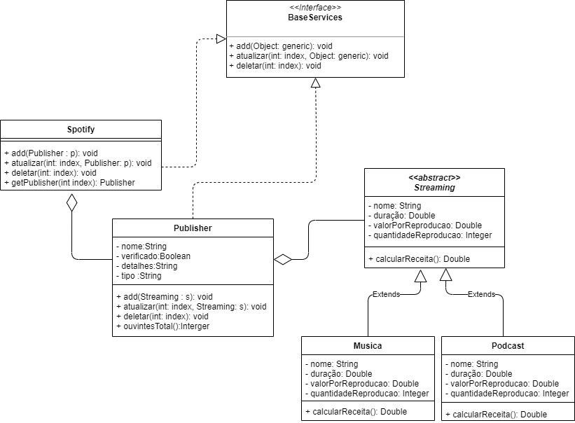

# Spotify
## API rest com Spring-Boot

[](https://www.spotify.com/br/)

O motivo pelo qual escolhi o tema spotify.

- Estou sempre ouvindo musica a todo momento.

## Features

- [x] Cria pulicadores
- [x] Cria musicas
- [x] Faz cálculo de receita de cada musica
- [x] Mostra o total de ouvintes de cada artista

A api consiste no **CRUD** de como funcionaria parte do *core* spotify, possibilitando a criação de musicas, artistas, podcast.

# Contexto
## Justificativa classe abstrata e interface
> Bom, dentro da regra de negócio que eu criei existe uma classe central que contem publicadores.
Assim, dentro do contexto é a classe **Spotify**, é onde basicamente tudo acontece.
**Ela foi injetada dentro dos controllers para poder utilizar da mesma lista de publicadores nas duas controllers** para que dentro do index da lista de streaming fosse possível a utilização do **CRUD usando a interface BaseServices**.
**Utilizo a interface pois tenho 2 classes que precisam do método de criar, atualizar e remover
Porém **essas classes não têm nenhum tipo de ligação por herança**.
Com tudo, adentrando mais ao negócio, foi criado também uma classe **abstrata chamada **Streaming**, onde nela é possível criar dois tipos de classes concretas, a classe Music e a Podcast.
Ambas possuem atributos iguais, a única coisa que muda é o método de calcular receita, onde ele pega atributos internos da classe e faz o cálculo, onde Podcast tem um bônus do valor total somado a 20% e Música tem um bônus de 15%.

# Diagrama de classe


# EndPoints
### Get
Para retornar uma lista de publicadores:
```
http://localhost:8080/publisher
```
retorno:
```json
{
    "listPublisher": [
        {
            "name": "Teto",
            "verified": true,
            "details": "Novo artista da cena",
            "type": "artista",
            "listStreaming": [
                {
                    "name": "Teto - M4 feat. Matuê",
                    "playingTime": 2.5,
                    "streamingValue": 10.0,
                    "amountOfStreaming": 27601402,
                    "calculateRevenue": 3.17416123E8
                }
            ],
            "totalListeners": 27601402
        },
        {
            "name": "FlowPodcast",
            "verified": true,
            "details": "Novo artista da cena",
            "type": "podcast",
            "listStreaming": [],
            "totalListeners": 0
        }
    ]
}
```

Para retornar um publicador:
```
http://localhost:8080/publisher/{index}
```
retorno:
```json
{
    "name": "Teto",
    "verified": true,
    "details": "Novo artista da cena",
    "type": "artista",
    "listStreaming": [
        {
            "name": "Teto - M4 feat. Matuê",
            "playingTime": 2.5,
            "streamingValue": 10.0,
            "amountOfStreaming": 27601402,
            "calculateRevenue": 3.17416123E8
        }
    ],
    "totalListeners": 27601402
}
```

Para retornar uma lista de musica ou podcast de um publicador:
```
http://localhost:8080/streaming/{index}
```
retorno:
```json
[
    {
        "name": "JÚLIO COCIELO - Flow Podcast #313",
        "playingTime": 32615.0,
        "streamingValue": 10.0,
        "amountOfStreaming": 1783878,
        "calculateRevenue": 2.1406536E7
    }
]
```
### Post
Para inserir um publicador:
```
http://localhost:8080/publisher
```
```json
{
    "name": "FlowPodcast",
    "verified": "true",
    "details": "Novo artista da cena",
    "type": "podcast"
}
```
##### é importante que o campo type seja sempre **podcast** ou **artista**
Para inserir uma musica:
```
http://localhost:8080/streaming/musica/{index}
```
```json
{
    "name": "Teto - M4 feat. Matuê",
    "playingTime": 2.50,
    "streamingValue": 10.0,
    "amountOfStreaming": 27601402
}
```
Para inserir um podcast:
```
http://localhost:8080/streaming/podcast/{index}
```
```json
{
    "name": "JÚLIO COCIELO - Flow Podcast #313",
    "playingTime": 32615,
    "streamingValue": 10.0,
    "amountOfStreaming": 1783878
}
```
### Put
Para atualizar um publicador:
```
http://localhost:8080/publisher/{index}
```
```json
{
    "name": "Teto",
    "verified": "true",
    "details": "artista da cena",
    "type": "artista"
}
```
Para atualizar uma musica:
```
http://localhost:8080/streaming/musica/{index publicador}/{index musica}
```
```json
{
    "name": "JÚLIO COCIELO - Flow Podcast #313",
    "playingTime": 32615,
    "streamingValue": 20.0,
    "amountOfStreaming": 1783878
}
```
Para atualizar um podcast:
```
http://localhost:8080/streaming/podcast/{index publicador}/{index podcast}
```
```json
{
    "name": "JÚLIO COCIELO - Flow Podcast #313",
    "playingTime": 32615,
    "streamingValue": 20.0,
    "amountOfStreaming": 1783878
}
```
### Delete
Para remover um publicador:
```
http://localhost:8080/publisher/{index}
```
Para remover uma musica ou podcast:
```
http://localhost:8080/streaming/{index publicador}/{index musica ou podcast}
```

#### bY Jorge Lucas 👨‍💻

